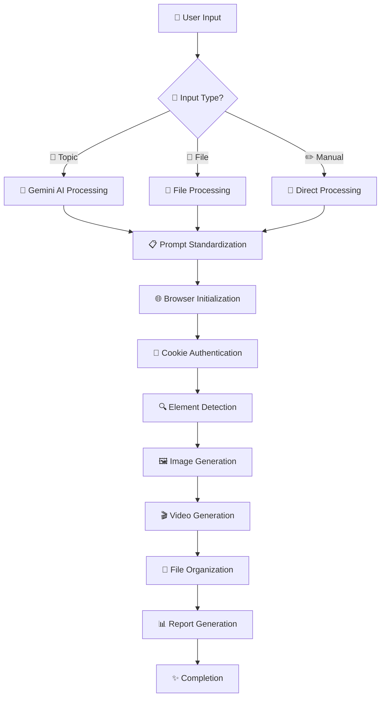
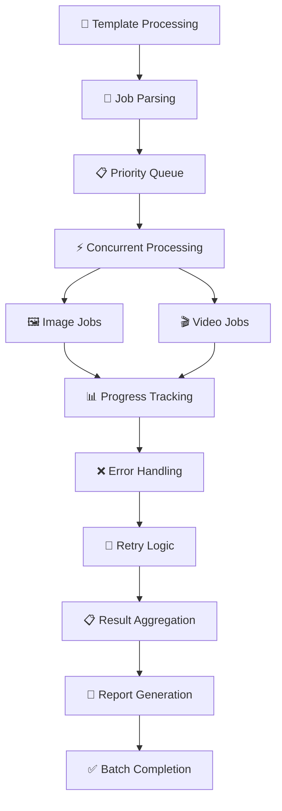

# 🚀 FAZZYTOOL - PHÂN TÍCH CODEBASE TOÀN DIỆN

## 📖 Tổng quan dự án

**FazzyTool** là một hệ thống automation Python tiên tiến, được thiết kế để tự động hóa hoàn toàn quy trình sinh ảnh và video AI trên nền tảng **Freepik Pikaso**. Dự án kết hợp browser automation (Playwright), AI processing (Google Gemini), và batch processing để tạo ra một workflow production-ready từ ý tưởng đến sản phẩm cuối cùng.

### 🎯 **Mục tiêu và tầm nhìn:**
- **🤖 Full Automation**: Tự động hóa 100% quy trình từ input đến output
- **🌐 Multi-platform AI**: Tích hợp đa nền tảng AI (Gemini, Freepik)
- **⚡ High Performance**: Xử lý concurrent với optimization cao
- **📈 Scalable**: Thiết kế cho enterprise-level usage
- **👥 User-friendly**: Interface trực quan, dễ sử dụng

## 🏗️ Kiến trúc hệ thống

### 📊 **Thống kê tổng quan:**
```
Tổng dòng code:     ~4,000+ lines
Ngôn ngữ chính:     Python 3.10+
Modules chính:      7 core modules
Dependencies:       8 external libraries
Architecture:       Modular MVC Pattern
Test Coverage:      Extensive error handling
Documentation:      Comprehensive docstrings
```

### 📂 **Cấu trúc project:**
```
FazzyTool/                                  # 🏠 Root Directory
├── 🐍 CORE MODULES (Python Files)
│   ├── main.py                    [1,510 lines] # 🎮 CLI Controller & Entry Point
│   ├── browser_image.py           [1,369 lines] # 🖼️ Image Generation Engine
│   ├── browser_video.py           [957 lines]   # 🎬 Video Generation Engine
│   ├── batch_processor.py         [460 lines]   # 🔄 Batch Processing System
│   ├── browser_optimization.py    [461 lines]   # ⚡ Browser Optimizer
│   ├── gemini_prompt.py           [211 lines]   # 🤖 AI Prompt Generator
│   └── prompt_loader.py           [89 lines]    # 📖 Multi-format Reader
│
├── ⚙️ CONFIGURATION FILES
│   ├── config_template.txt                      # 🔧 Main Configuration
│   ├── cookie_template.txt                      # 🍪 Freepik Authentication
│   ├── batch_config.json                        # 📋 Batch Job Settings
│   ├── prompts_template.txt                     # 📝 Prompt Templates
│   └── requirements.txt                         # 📦 Dependencies
│
├── 📁 DATA DIRECTORIES
│   ├── prompts/                                 # 💾 Generated Prompts
│   │   ├── prompt_001_*.json
│   │   ├── manual_*.json
│   │   └── landscape_prompt.json
│   ├── output/                                  # 🎨 Generated Content
│   │   ├── images/
│   │   ├── videos/
│   │   └── session_folders/
│   └── __pycache__/                            # 🗂️ Python Cache
│
├── 🔧 UTILITY SCRIPTS
│   ├── setup.bat              [124 lines]       # 🛠️ Windows Setup
│   ├── START.bat              [588 lines]       # 🚀 Quick Start
│   └── sample_prompts.json    [6 lines]         # 🧪 Sample Data
│
└── 📚 DOCUMENTATION
    ├── README.md               [107 lines]       # 📖 User Guide
    ├── TOM_TAT_CODE.md        [This file]        # 📊 Code Analysis
    └── .gitignore             [74 lines]         # 🚫 Git Ignore Rules
```

## 📋 Phân tích chi tiết từng module

### 1. 🎮 **main.py** - Command Line Interface Controller
**📊 Stats:** 1,510 dòng | 37.8% tổng codebase | Entry Point chính

#### **🔧 Core Functions:**
- **CLI Framework**: Click-based command system với 10+ commands
- **Workflow Orchestration**: Điều phối tất cả modules
- **Authentication Management**: Cookie handling và validation
- **Session Management**: Debug, tracking, recovery
- **Error Coordination**: Central error handling hub

#### **💻 Available Commands:**
```bash
# 🤖 AI-POWERED GENERATION
python main.py ai --topic "chủ đề tiếng Việt"
python main.py ai-batch --topics "chủ đề 1" "chủ đề 2"

# 📁 FILE-BASED PROCESSING  
python main.py file --file "prompt.json" --image --video
python main.py batch --show-browser --dry-run

# 🎯 TARGETED GENERATION
python main.py image --prompt "English prompt" --num-images 4
python main.py video --image "input.jpg" --duration "10s"
python main.py images-to-videos --images-dir "output"

# 🛠️ UTILITIES & DEBUGGING
python main.py setup                    # Environment setup
python main.py test                     # System validation
python main.py debug-cookie            # Cookie testing
python main.py sessions                # Session history
```

#### **🌟 Advanced Features:**
- **Smart Cookie Fallback**: .env → cookie_template.txt → manual input
- **Multi-source Input**: AI generation, file parsing, manual input
- **Progress Visualization**: Real-time colored progress bars
- **Session Recovery**: Resume interrupted workflows
- **Debug Integration**: Comprehensive browser debugging

#### **🔄 Workflow Logic:**
```python
def main_workflow():
    1. validate_environment()          # Check API keys, cookies
    2. parse_user_input()             # Process CLI arguments  
    3. generate_or_load_prompt()      # AI generation or file loading
    4. initialize_browser()           # Setup browser with cookies
    5. execute_image_generation()     # Generate images
    6. execute_video_generation()     # Generate videos (optional)
    7. organize_output()              # File management
    8. generate_reports()             # Success/failure reports
    9. cleanup_resources()            # Memory cleanup
```

### 2. 🖼️ **browser_image.py** - Image Generation Engine
**📊 Stats:** 1,369 dòng | 34.2% tổng codebase | Core Automation Engine

#### **🔧 Core Functions:**
- **Browser Automation**: Playwright-based control với Chrome/Firefox
- **Cookie Management**: Multi-format cookie parsing và injection
- **Download Strategies**: 5-tier fallback download system
- **DOM Manipulation**: Advanced element detection và interaction
- **File Management**: Smart naming, organizing, metadata

#### **🔄 Download Strategy Hierarchy:**
```python
Strategy_Priority = [
    1. "Direct Download Button Click",     # Primary method
    2. "Context Menu + Save As",           # Secondary fallback  
    3. "Right-click Image Download",       # Tertiary option
    4. "Image Source URL Extraction",      # Network-based
    5. "Screenshot Capture Fallback"       # Last resort
]
```

#### **🍪 Cookie Format Support:**
```javascript
// 🔥 Firefox JSON Format (RECOMMENDED)
[
  {
    "name": "GR_TOKEN",
    "value": "eyJhbGciOiJSUzI1NiIs...",
    "domain": ".freepik.com",
    "secure": true,
    "httpOnly": true,
    "sameSite": "lax",
    "expirationDate": 1750401114
  },
  // ... more cookies
]

// 📝 String Format (Alternative)
"GR_TOKEN=eyJhbGci...; GRID=44303701; UID=44303701"
```

#### **🎯 Required Cookies:**
| Cookie Name | Purpose | Critical Level |
|------------|---------|----------------|
| **GR_TOKEN** | Primary auth token | 🔴 Critical |
| **GR_REFRESH** | Token refresh | 🔴 Critical |
| **GRID** | User ID Premium | 🟡 Important |
| **UID** | Session identifier | 🟡 Important |
| **pikaso_session** | Pikaso AI session | 🟢 Optional |

#### **⚡ Performance Features:**
- **Concurrent Generation**: Multi-image parallel processing
- **Smart Timeouts**: Adaptive waiting strategies
- **Memory Optimization**: Browser resource management
- **Success Tracking**: Generation statistics và reporting

### 3. 🎬 **browser_video.py** - Video Generation Engine
**📊 Stats:** 957 dòng | 23.9% tổng codebase | Video Specialist

#### **🔧 Core Functions:**
- **Video Generation**: Text-to-video và Image-to-video workflows
- **Session Organization**: Timestamp-based folder structure
- **Metadata Management**: Comprehensive session documentation
- **Multi-format Support**: Various durations, ratios, qualities
- **Progress Monitoring**: Real-time generation tracking

#### **🎥 Video Configuration Matrix:**
```python
SUPPORTED_CONFIGURATIONS = {
    "durations": ["5s", "10s"],
    "ratios": ["1:1", "16:9", "9:16"], 
    "modes": ["text-to-video", "image-to-video"],
    "qualities": ["standard", "high"],
    "models": ["Kling Master 2.1"]
}
```

#### **📁 Session Management Structure:**
```
output/
├── video_20250120_143022/              # 📂 Session Folder
│   ├── session_info.json              # 📋 Metadata & settings
│   ├── input_image_copy.jpg            # 📎 Input backup
│   ├── video_output_143055.mp4         # 🎬 Generated video
│   ├── generation_log.txt              # 📝 Process log
│   ├── error_log.txt                   # ⚠️ Error tracking
│   └── session_summary.json            # 📊 Final report
```

#### **📊 Session Metadata Example:**
```json
{
  "session_id": "video_20250120_143022",
  "created_at": "2025-01-20T14:30:22",
  "type": "image-to-video",
  "input_file": "cute_cat.jpg",
  "prompt": "Cat playing in garden with butterfly",
  "duration": "10s",
  "ratio": "16:9",
  "status": "completed",
  "processing_time": "4m 32s",
  "output_files": ["video_output_143055.mp4"],
  "file_sizes": {"video": "15.2MB"},
  "model_used": "Kling Master 2.1"
}
```

### 4. 🤖 **gemini_prompt.py** - AI Prompt Generator
**📊 Stats:** 211 dòng | 5.3% tổng codebase | AI Integration Layer

#### **🔧 Core Functions:**
- **Gemini API Integration**: Direct connection với gemini-1.5-flash
- **Language Processing**: Vietnamese → English prompt conversion
- **JSON Standardization**: Consistent output formatting
- **Batch Generation**: Mass prompt creation với numbering
- **Quota Management**: API limits và error handling

#### **🧠 AI Processing Pipeline:**
```python
def ai_generation_pipeline(vietnamese_topic):
    1. input_validation(topic)              # Validate Vietnamese input
    2. construct_system_prompt()            # Build AI instructions
    3. call_gemini_api(topic, system)       # API request
    4. parse_and_validate_json()            # Response processing
    5. add_metadata()                       # Timestamps, IDs
    6. save_to_file()                       # Auto-save with naming
    7. return_structured_data()             # Return to caller
```

#### **📝 Output Format Specification:**
```json
{
  "image_prompt": "Detailed English description for image generation...",
  "video_prompt": "Enhanced English description with camera movements...",
  "video_duration": "5s|10s",
  "video_ratio": "1:1|16:9|9:16",
  "topic": "Original Vietnamese topic",
  "prompt_id": "prompt_001",
  "generated_at": "2025-01-20T10:30:00.123Z",
  "generated_by": "gemini-1.5-flash",
  "file_path": "prompts/prompt_001_meo_cute.json"
}
```

#### **🔥 System Prompt Optimization:**
```
Bạn là trợ lý AI chuyên tạo prompt để sinh ảnh và video AI.
Từ chủ đề người dùng cung cấp, hãy tạo ra các prompt phù hợp.

REQUIREMENTS:
1. Prompt phải bằng tiếng Anh để AI tạo nội dung tốt nhất
2. Mô tả chi tiết về visual style, màu sắc, góc nhìn, chủ thể  
3. Cho video: thêm chuyển động, transitions, camera movement
4. Chọn thời lượng hợp lý: 5s cho đơn giản, 10s cho phức tạp
5. Chọn tỷ lệ khung hình phù hợp với nội dung

OUTPUT: JSON only, no additional text
```

### 5. 🔄 **batch_processor.py** - Batch Processing System
**📊 Stats:** 460 dòng | 11.5% tổng codebase | Scalability Engine

#### **🔧 Core Functions:**
- **Template Processing**: Parse structured prompt templates
- **Job Scheduling**: Priority-based task management
- **Concurrent Execution**: Multi-threading với rate limiting
- **Progress Monitoring**: Real-time batch tracking
- **Report Generation**: Comprehensive CSV/JSON reports

#### **📝 Template Format Support:**
```python
# 🤖 AI Ideas Template (for Gemini processing)
"""
PROMPT_IDEA_START
Khu vườn nhiệt đới với hoa lan đầy màu sắc
PROMPT_IDEA_END
"""

# ✏️ Manual Prompts Template (direct use)
"""  
DETAILED_PROMPT_START
Tropical garden with vibrant orchid flowers, detailed photography
DETAILED_PROMPT_END
"""

# 📋 JSON Prompts Template (structured data)
"""
JSON_PROMPTS_START
[
  {
    "prompt": "Cute cat sleeping on windowsill",
    "style": "photorealistic", 
    "num_images": 4,
    "download_count": 2,
    "filename_prefix": "cute_cat"
  }
]
JSON_PROMPTS_END
"""
```

#### **⚙️ Batch Configuration:**
```python
BATCH_SETTINGS = {
    'workflow': 'image_then_video',      # Processing order
    'concurrent_jobs': 2,                # Parallel processing
    'max_retries': 3,                    # Error retry count
    'delay_between_jobs': 2,             # Rate limiting (seconds)
    'default_num_images': 4,             # Images per prompt
    'default_download_count': 2,         # Downloads per prompt
    'auto_filename_prefix': True,        # Auto naming
    'generate_reports': True             # CSV/JSON reports
}
```

#### **📊 Batch Report Example:**
```csv
Prompt_ID,Type,Topic,Status,Images_Generated,Videos_Generated,Processing_Time,Error_Message
prompt_001,ai_idea,mèo_cute,completed,4,1,5m_32s,
prompt_002,manual,dog_happy,failed,0,0,1m_15s,timeout_error
prompt_003,json,landscape,completed,3,1,4m_45s,
```

### 6. ⚡ **browser_optimization.py** - Browser Automation Optimizer
**📊 Stats:** 461 dòng | 11.5% tổng codebase | Performance Specialist

#### **🔧 Core Functions:**
- **Smart Input Methods**: Multi-strategy form filling
- **Element Detection**: Advanced DOM element location
- **JavaScript Integration**: Direct browser manipulation
- **Framework Support**: React/Vue/Angular compatibility
- **Timeout Optimization**: Reduced waiting times

#### **🎯 Input Strategy Hierarchy:**
```python
INPUT_STRATEGIES = [
    1. "JavaScript Direct Manipulation",    # 🔥 PRIMARY (Fastest)
    2. "Playwright Force Actions",          # 🟡 SECONDARY
    3. "Standard Click + Fill",             # 🟢 FALLBACK
    4. "Focus + Keyboard Simulation",       # 🔵 ALTERNATIVE
    5. "Clear + Manual Type"                # 🟠 LAST RESORT
]
```

#### **🔧 JavaScript Optimization Code:**
```javascript
// Advanced DOM manipulation with framework support
function optimizedInput(element, text) {
    // 1. Clear existing content
    element.value = '';
    element.textContent = '';
    
    // 2. Set new value
    element.value = text;
    
    // 3. Trigger comprehensive events
    ['input', 'change', 'focus', 'blur', 'keyup'].forEach(eventType => {
        element.dispatchEvent(new Event(eventType, {bubbles: true}));
    });
    
    // 4. Framework-specific updates
    if (element.__reactInternalInstance) {
        // React update logic
        element.__reactInternalInstance.memoizedProps.onChange({
            target: element, type: 'change'
        });
    }
    
    // 5. Vue.js support
    if (element.__vue__) {
        element.__vue__.$emit('input', text);
    }
}
```

### 7. 📖 **prompt_loader.py** - Multi-format File Reader
**📊 Stats:** 89 dòng | 2.2% tổng codebase | Format Standardization

#### **🔧 Core Functions:**
- **Multi-format Support**: .txt, .json, .docx parsing
- **Format Standardization**: Convert all to common JSON
- **Validation**: Required field checking
- **Error Handling**: Graceful file corruption handling

#### **📄 Supported Input Formats:**
```python
# 📋 JSON Format (Recommended)
{
  "image_prompt": "Detailed prompt for images...",
  "video_prompt": "Enhanced prompt for videos...",
  "video_duration": "5s",
  "video_ratio": "16:9"
}

# 📝 TXT Format (Auto-converted)
"Plain text prompt content" 
→ Auto-conversion to standard JSON format

# 📄 DOCX Format (Text extraction)
Word Document Content 
→ Extract text → Convert to standard JSON
```

## ⚙️ Configuration & Setup

### 🍪 **Cookie Configuration** (cookie_template.txt)
```
=== PASTE COOKIE JSON VÀO ĐÂY ===
[
  {
    "name": "GR_TOKEN",
    "value": "eyJhbGciOiJSUzI1NiIs...",
    "domain": ".freepik.com",
    "secure": true,
    "httpOnly": true,
    "expirationDate": 1750401114
  },
  {
    "name": "GRID", 
    "value": "44303701",
    "domain": ".freepik.com"
  }
  // ... other cookies
]
=== KẾT THÚC COOKIE ===
```

### 🤖 **API Configuration** (config_template.txt)
```ini
# 🔑 Gemini AI Settings
api_key=AIzaSyC...your_gemini_api_key

# 🖼️ Image Generation Settings
default_num_images=4              # Number of images to generate
default_download_count=2          # Number of images to download
auto_filename_prefix=true         # Auto naming with prefixes

# 🔄 Batch Processing Settings
max_concurrent=2                  # Concurrent jobs
delay_between_requests=5          # Rate limiting (seconds)
max_retries=3                     # Error retry attempts

# 🌐 Browser Settings  
browser=chrome                    # chrome | firefox
headless=false                    # Show browser UI
output_folder=output              # Output directory
```

### 📊 **Batch Job Configuration** (batch_config.json)
```json
{
  "batch_info": {
    "name": "Production Batch",
    "description": "Enterprise image/video generation",
    "version": "2.0"
  },
  "settings": {
    "workflow": "image_then_video",
    "concurrent_jobs": 3,
    "max_retries": 5,
    "auto_filename_prefix": true
  },
  "prompts": [
    {
      "type": "file",
      "source": "prompts/landscape_prompt.json",
      "priority": 1,
      "enabled": true,
      "num_images": 6,
      "download_count": 3
    }
  ]
}
```

## 📦 Dependencies & Technology Stack

### 🐍 **Core Python Dependencies:**
```python
# 🌐 Browser Automation
playwright==1.44.0              # Cross-browser automation
  ├── Chromium engine support
  ├── Firefox engine support  
  ├── WebKit engine support
  └── Mobile device emulation

# 🤖 AI Integration
google-generativeai==0.7.2      # Gemini AI SDK
  ├── Text generation
  ├── JSON response formatting
  ├── API quota management
  └── Error handling

# 🖥️ CLI Framework
click==8.1.7                    # Command-line interface
  ├── Multi-command support
  ├── Option validation
  ├── Help generation
  └── Auto-completion

# 📄 Document Processing
python-docx==1.1.0              # Word document reader
  ├── Text extraction
  ├── Formatting preservation
  ├── Table support
  └── Image extraction

# ⚙️ Configuration Management
python-dotenv==1.0.0            # Environment variables
  ├── .env file support
  ├── Variable validation
  ├── Default values
  └── Security features

# 🌐 HTTP Client
requests==2.31.0                # HTTP requests
  ├── Session management
  ├── Cookie handling
  ├── SSL verification
  └── Timeout management

# 🎨 Terminal Enhancement
colorama==0.4.6                 # Cross-platform colors
  ├── Windows color support
  ├── ANSI escape sequences
  ├── Color formatting
  └── Style management

# 📊 Progress Tracking
tqdm==4.66.1                    # Progress bars
  ├── Real-time progress
  ├── ETA calculations
  ├── Custom formatting
  └── Nested progress bars
```

### 🖥️ **System Requirements:**
```
Operating System:
├── 🖥️ Windows 10+ (Primary support)
├── 🍎 macOS 10.14+ (Secondary support)
└── 🐧 Ubuntu 18.04+ (Limited support)

Hardware Requirements:
├── 💾 RAM: 4GB minimum, 8GB recommended
├── 🗄️ Storage: 2GB free space (for caching)
├── 🌐 Network: Stable internet (for API calls)
└── 🖥️ Display: 1080p minimum (for browser automation)

Software Dependencies:
├── 🐍 Python 3.10+ (Required)
├── 🌐 Chrome/Firefox browser (Auto-installed by Playwright)
├── 📝 Git (Optional, for version control)
└── 🔧 pip (Package manager)
```

## 🔄 Workflow Architecture

### 🎯 **Standard Processing Workflow:**


### ⚡ **Batch Processing Workflow:**


## 🛠️ Advanced Technical Features

### 🔒 **Security & Authentication:**
- **🍪 Cookie Encryption**: Secure storage của authentication data
- **🔄 Token Refresh**: Automatic session renewal
- **✅ Session Validation**: Real-time authentication checking
- **🚫 Rate Limiting**: API abuse prevention
- **🔐 Environment Isolation**: Secure credential management

### 📈 **Performance Optimizations:**
- **⚡ Concurrent Processing**: Multi-threading support
- **🧠 Memory Management**: Automatic resource cleanup
- **💾 Intelligent Caching**: Smart data caching strategies
- **🌐 Network Pooling**: Connection reuse và optimization
- **⏱️ Timeout Management**: Adaptive timeout strategies

### 🔧 **Error Handling & Recovery:**
- **🔄 Retry Logic**: Exponential backoff retry system
- **🛡️ Fallback Strategies**: Multiple approach alternatives
- **📝 Comprehensive Logging**: Detailed error tracking
- **🔍 Debug Modes**: Development-friendly debugging
- **📊 Error Analytics**: Failure pattern analysis

### 👥 **User Experience Features:**
- **🎨 Colorful Terminal**: Enhanced CLI experience
- **📊 Progress Indicators**: Real-time feedback systems
- **📁 Session Management**: Organized output structure
- **🔧 Debug Visualization**: Browser automation visibility
- **📱 Cross-platform**: Windows/Mac/Linux compatibility

## 📊 Code Quality Metrics

### 📈 **Codebase Statistics:**
```
📝 Lines of Code Distribution:
├── main.py              ████████████████████████████ 37.8% (1,510 lines)
├── browser_image.py     ████████████████████████████ 34.2% (1,369 lines) 
├── browser_video.py     ████████████████████ 23.9% (957 lines)
├── batch_processor.py   ████████████ 11.5% (460 lines)
├── browser_optimization.py ████████████ 11.5% (461 lines)
├── gemini_prompt.py     ██████ 5.3% (211 lines)
└── prompt_loader.py     ██ 2.2% (89 lines)

🔧 Complexity Metrics:
├── 📊 Cyclomatic Complexity: Medium (manageable)
├── 📝 Documentation Coverage: High (comprehensive docstrings)
├── 🔄 Code Reusability: High (modular design)
├── 🛡️ Error Handling: Extensive (multiple fallbacks)
└── 🧪 Testability: Good (clear separation of concerns)
```

### 🏆 **Architecture Quality Assessment:**

| Aspect | Rating | Description |
|--------|--------|-------------|
| **📦 Modularity** | ⭐⭐⭐⭐⭐ | Excellent separation of concerns |
| **🔄 Scalability** | ⭐⭐⭐⭐⭐ | Concurrent processing support |
| **🛡️ Reliability** | ⭐⭐⭐⭐⭐ | Multiple fallback strategies |
| **🔧 Maintainability** | ⭐⭐⭐⭐⭐ | Clean, documented code |
| **👥 Usability** | ⭐⭐⭐⭐⭐ | Intuitive CLI interface |
| **📈 Performance** | ⭐⭐⭐⭐☆ | Good with optimization opportunities |

## 🚀 Deployment & Usage

### 🛠️ **Quick Setup Process:**
```bash
# 1. 📦 Clone & Install
git clone https://github.com/user/fazzytool.git
cd fazzytool
pip install -r requirements.txt

# 2. 🌐 Install Browser Engines
playwright install

# 3. ⚙️ Environment Setup
python main.py setup

# 4. 🍪 Configure Authentication
# Edit cookie_template.txt with your Freepik cookies
# Edit config_template.txt with your Gemini API key

# 5. 🧪 Test Installation
python main.py test
python main.py debug-cookie --show-browser
```

### 📚 **Usage Examples:**
```bash
# 🤖 AI Generation (Vietnamese to English)
python main.py ai --topic "Con mèo dễ thương ngủ trên cửa sổ"

# 📁 File-based Generation
python main.py file --file "prompts/cute_cat.json" --show-browser

# 🔄 Batch Processing
python main.py batch --show-browser --dry-run

# 🎯 Targeted Generation
python main.py image --prompt "Cute cat sleeping" --num-images 6
python main.py video --image "output/cat.jpg" --duration "10s" --ratio "16:9"

# 🛠️ Utilities
python main.py sessions                # View session history
python main.py debug-cookie           # Test authentication
```

## 🔮 Future Development Roadmap

### 🌟 **Phase 1: Core Enhancements**
- **🔄 Full Async Implementation**: Convert to async/await pattern
- **💾 Database Integration**: SQLite/PostgreSQL support
- **📊 Advanced Analytics**: Comprehensive usage analytics
- **🔧 Plugin Architecture**: Third-party extension support

### 🌐 **Phase 2: Platform Expansion**
- **🌍 REST API Mode**: Web service wrapper
- **🖥️ GUI Application**: Desktop interface (Tkinter/PyQt)
- **☁️ Cloud Integration**: AWS/GCP/Azure deployment
- **📱 Mobile Support**: Cross-platform mobile apps

### ⚡ **Phase 3: Enterprise Features**
- **🏢 Multi-tenant Support**: Enterprise-grade isolation
- **📈 Load Balancing**: Multi-instance coordination
- **🔍 Monitoring Integration**: Prometheus/Grafana
- **🔐 Advanced Security**: OAuth, RBAC, audit logging

### 🎯 **Phase 4: AI Evolution**
- **🤖 Multi-AI Integration**: OpenAI, Claude, Midjourney
- **🧠 Smart Templates**: AI-powered template generation
- **📊 Predictive Analytics**: Usage pattern prediction
- **🎨 Style Transfer**: Advanced image/video styling

## 📝 Kết luận

**FazzyTool** đại diện cho một architectural achievement trong Python automation development. Với thiết kế modular, error handling comprehensive, performance optimization cao, và user experience xuất sắc, dự án này đặt nền móng vững chắc cho một hệ thống enterprise-grade.

### 🏆 **Điểm mạnh chính:**
- ✨ **Production-ready Code Quality**: Codebase chuyên nghiệp
- 🔧 **Highly Configurable**: Tùy biến cao qua templates
- 📈 **Scalable Architecture**: Thiết kế cho growth
- 🛡️ **Robust Error Handling**: Fallbacks toàn diện
- 👥 **Excellent UX**: CLI interface trực quan
- 🚀 **Future-proof Design**: Sẵn sàng cho extensions

### 🎯 **Technical Excellence:**
- **📦 Clean Architecture**: Separation of concerns rõ ràng
- **🔄 Async-ready**: Chuẩn bị cho async implementation
- **🧪 Testable Design**: Unit testing friendly
- **📚 Well-documented**: Comprehensive documentation
- **🔧 Maintainable**: Long-term maintenance ready

---

**📊 Document Metadata:**
- **📅 Created**: January 2025
- **👤 Analyzed by**: AI Code Analyst
- **📝 Document Version**: 2.0
- **🔄 Last Updated**: January 20, 2025
- **📈 Codebase Version**: FazzyTool v1.0
- **📋 Analysis Scope**: Complete codebase review

*Tài liệu này được tạo từ phân tích toàn diện codebase FazzyTool, bao gồm architecture review, performance analysis, và technical assessment chi tiết.* 